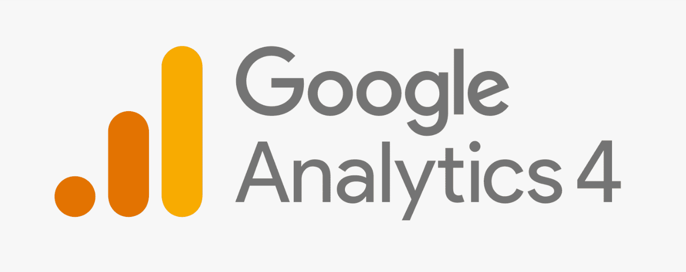
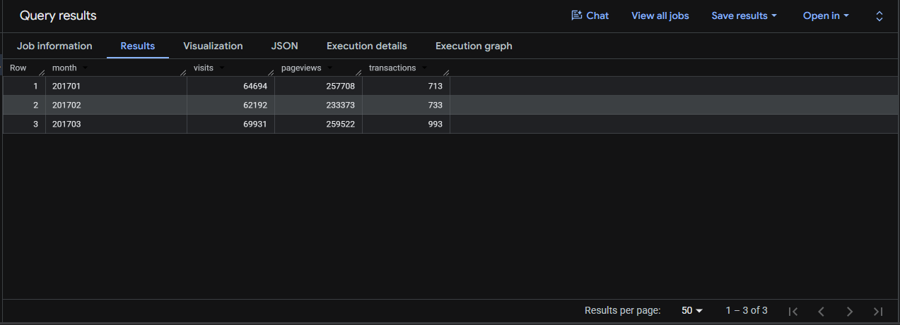
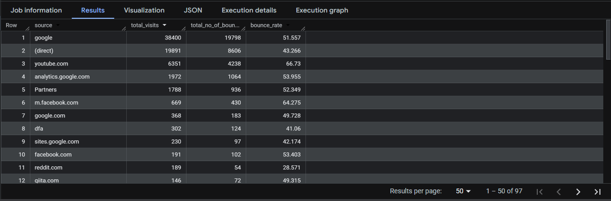
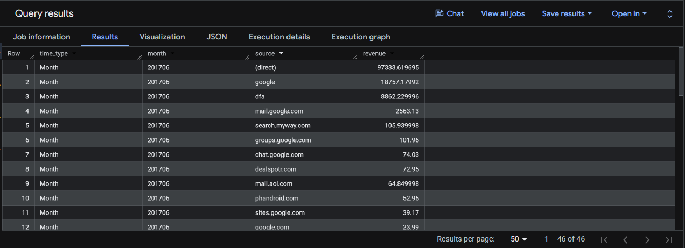
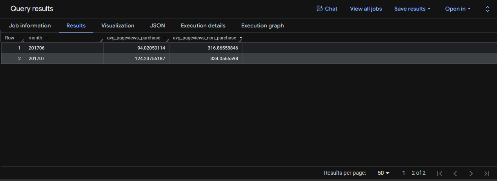
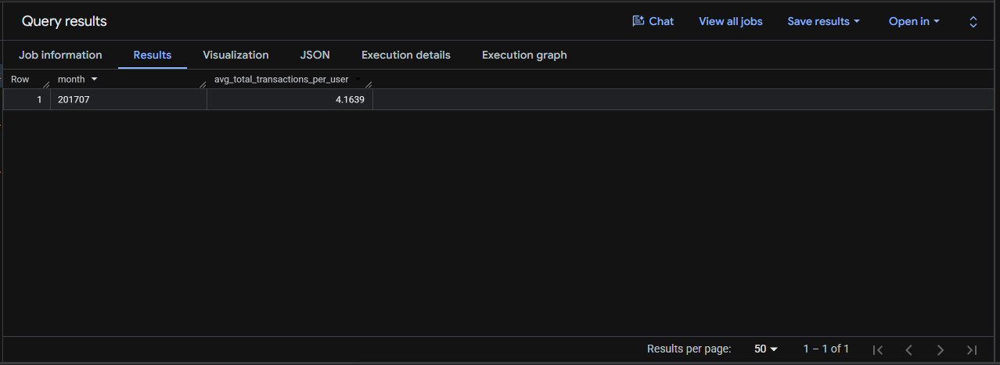
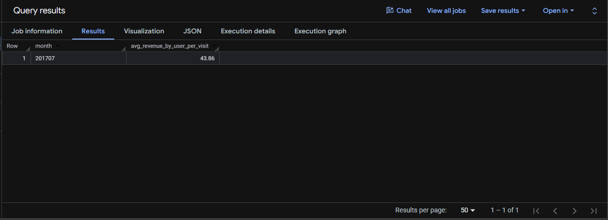
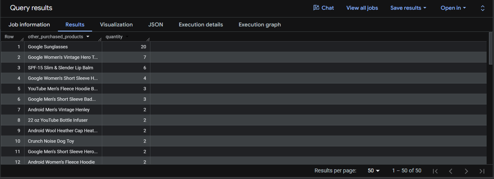
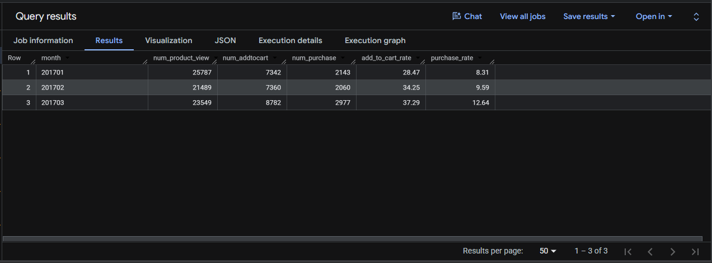

# 🛒 SQL | Google Analytics Session Analysis


---

<p align="center">
  
</p>

_Analyze website traffic, user engagement, and purchase behavior to answer 8 business questions and turn raw analytics data into clear insights._

- 🎯 **Business Question:** Which traffic sources drive the most revenue - and how do user engagement patterns differ between purchasers and non-purchasers?
- 🏬 **Domain:** E-commerce & Digital Marketing
- 🛠️ **Tools:** SQL (Google BigQuery)

👤 **Author:** Bạch Minh Nam

---

### 📑 Table of Contents

- [📌 Overview](#-overview)
- [📂 Dataset](#-dataset)
- [🔎 Query Repository](#-query-repository)
- [🎯 Key Findings](#-key-findings)

---

## 📌 Overview

**🎯 Objective:**

- This project uses SQL (Google BigQuery) to analyze **Google Analytics 4 (GA4)** data from the **Google Merchandise Store** e-commerce website
- It answers 8 specific business questions covering **Traffic Performance, User Engagement, Revenue Analysis, and Conversion Funnel Optimization**
- The goal is to turn raw session and event data into clear, actionable insights for marketing and product teams

**❓ Main business question:**

This project uses SQL to analyze website traffic, engagement, and revenue data from Google Analytics to:
- Track changes in visits, pageviews, and transactions over time
- Evaluate which traffic sources generate the most revenue and engagement
- Compare user behavior between purchasers and non-purchasers
- Identify cross-selling opportunities and conversion funnel bottlenecks

**👤 Who is this project for?**

- **Data analysts & business analysts** who want a reference for writing analytical SQL (CTEs, window functions, cohort analysis, UNNEST operations)
- **Digital marketing teams** who need insights into traffic source performance and ROI
- **E-commerce managers & stakeholders** who need quick insights into revenue trends, user engagement, and conversion rates
- **Business intelligence teams** building dashboards and reporting systems

---

## 📂 Dataset

The analysis is based on **Google Analytics 4 (GA4)** data exported to **Google BigQuery**, representing the **Google Merchandise Store**, a real e-commerce website selling branded merchandise. It contains data on user sessions, page views, product interactions, transactions, and revenue across multiple months in 2017.

### Data Dictionary

To answer the 8 business questions in this project, **6 core data structures** from the GA4 export schema were used. The table below lists only the columns that were actually used in the queries.

| Schema | Table / Struct | Columns Used | Used In | Purpose |
| :--- | :--- | :--- | :--- | :--- |
| **Sessions** | `ga_sessions_2017*` | `date`, `fullVisitorId` | Q1, Q2, Q4, Q5, Q6, Q8 | Base session table tracking unique users and session timestamps for all temporal analysis. |
| **Sessions** | `totals` | `visits`, `pageviews`, `transactions`, `bounces` | Q1, Q2, Q4, Q5, Q6 | Aggregate metrics per session - visits, pageviews, bounce count, transaction count for KPI calculations. |
| **Sessions** | `trafficSource` | `source` | Q2, Q3 | Identifies traffic channel origin (organic search, direct, referral, paid ads) to analyze channel performance. |
| **Hits** | `hits` | `eCommerceAction` | Q8 | Unnested to capture individual user actions within a session (product view, add to cart, purchase). |
| **Hits** | `eCommerceAction` | `action_type` | Q8 | Action type codes (**'2'=View, '3'=Add to Cart, '6'=Purchase**) to build conversion funnel analysis. |
| **Product** | `product` | `v2ProductName`, `productRevenue`, `productQuantity` | Q3, Q4, Q6, Q7, Q8 | Unnested product-level data to track revenue, quantities sold, and product-specific insights. |

> 🔗 **Full Documentation:** For the complete explanation of all available fields in the GA4 BigQuery export schema, please refer to the [Official Google Analytics BigQuery Export schema](https://support.google.com/analytics/answer/3437719?hl=en).

---

## 🔎 Query Repository

### Query 1: Monthly Traffic Overview (Jan–Mar 2017)

*Question: Calculate total visits, pageviews, and transactions for January, February, and March 2017.*

> _Tracking monthly traffic metrics helps the business understand seasonal demand patterns and measure the impact of marketing campaigns across the first quarter._

```sql
SELECT 
  FORMAT_DATE('%Y%m', PARSE_DATE('%Y%m%d', date)) AS month,
  COUNT(totals.visits) AS visits,
  SUM(totals.pageviews) AS pageviews,
  SUM(totals.transactions) AS transactions
FROM `bigquery-public-data.google_analytics_sample.ga_sessions_2017*`
WHERE _table_suffix BETWEEN '0101' AND '0331'
GROUP BY month
ORDER BY month
```

**📊 Actual Output:**


**💡 Observations:**

Visits grew from 64K (Jan) to 70K (Mar), pageviews from 257K to 294K, and transactions jumped from 700 to nearly 1,000. Growth acceleration in March suggests successful marketing campaign or new product launch. Investigate March drivers and replicate.

---

### Query 2: Bounce Rate by Traffic Source (July 2017)

*Question: Calculate the bounce rate per traffic source in July 2017.*

> _High bounce rates indicate poor landing page relevance or user experience issues. Identifying which traffic sources bounce most helps prioritize optimization efforts and reallocate budget from underperforming channels._

```sql
SELECT
  trafficSource.source AS source,
  SUM(totals.visits) AS total_visits,
  SUM(totals.bounces) AS total_no_of_bounces,
  ROUND(SUM(totals.bounces) / SUM(totals.visits) * 100, 3) AS bounce_rate
FROM `bigquery-public-data.google_analytics_sample.ga_sessions_201707*`
GROUP BY source
ORDER BY total_visits DESC
```

**📊 Actual Output:**


**💡 Observations:**

Google sends 38K visits but 51% bounce. YouTube bounces worst at 67%. Direct traffic (43% bounce) converts best-loyal customers. Landing page misalignment for Google/YouTube traffic requires urgent optimization.

---

### Query 3: Revenue by Traffic Source (June 2017 – Weekly & Monthly)

*Question: Calculate revenue by traffic source by week and by month in June 2017.*

> _Breaking revenue down by traffic source and time period reveals which channels are most profitable and when peak revenue occurs. This guides budget allocation and campaign timing decisions._

```sql
WITH month_data AS (
  SELECT
    'Month' AS time_type,
    FORMAT_DATE('%Y%m', PARSE_DATE('%Y%m%d', date)) AS month,
    trafficSource.source AS source,
    SUM(p.productRevenue) / 1000000 AS revenue
  FROM `bigquery-public-data.google_analytics_sample.ga_sessions_201706*`,
    UNNEST(hits) AS hits,
    UNNEST(product) AS p
  WHERE p.productRevenue IS NOT NULL
  GROUP BY 1, 2, 3
),

week_data AS (
  SELECT
    'Week' AS time_type,
    FORMAT_DATE('%Y%W', PARSE_DATE('%Y%m%d', date)) AS week,
    trafficSource.source AS source,
    SUM(p.productRevenue) / 1000000 AS revenue
  FROM `bigquery-public-data.google_analytics_sample.ga_sessions_201706*`,
    UNNEST(hits) AS hits,
    UNNEST(product) AS p
  WHERE p.productRevenue IS NOT NULL
  GROUP BY 1, 2, 3
)

SELECT * FROM month_data
UNION ALL
SELECT * FROM week_data
ORDER BY time_type, revenue DESC
```

**📊 Actual Output:**


**💡 Observations:**

Direct traffic dominates revenue ($97K in June), followed by Google ($18.7K). YouTube/referral traffic bring visitors but zero revenue conversion. Shift budget from non-converting to high-ROI channels (direct, Google).

---

### Query 4: Avg Pageviews - Purchasers vs Non-Purchasers (Jun–Jul 2017)

*Question: Calculate average number of pageviews by purchaser type (purchasers vs non-purchasers) in June and July 2017.*

> _Comparing engagement between buyers and non-buyers reveals the page view threshold needed to drive conversion. Higher pageview counts among purchasers signal deeper product exploration before purchase._

```sql
WITH
  base AS (
    SELECT
      FORMAT_DATE('%Y%m', PARSE_DATE('%Y%m%d', date)) AS month,
      totals.transactions,
      product.productRevenue,
      totals.pageviews,
      fullVisitorId
    FROM `bigquery-public-data.google_analytics_sample.ga_sessions_2017*`,
      UNNEST(hits) AS hits,
      UNNEST(product) AS product
    WHERE _table_suffix BETWEEN '0601' AND '0731'
  ),

  purchase AS (
    SELECT
      month,
      ROUND(SUM(pageviews) / COUNT(DISTINCT fullVisitorId), 8) AS avg_pageviews_purchase
    FROM base
    WHERE transactions >= 1 
      AND productRevenue IS NOT NULL
    GROUP BY month
  ),

  non_purchase AS (
    SELECT
      month,
      ROUND(SUM(pageviews) / COUNT(DISTINCT fullVisitorId), 8) AS avg_pageviews_non_purchase
    FROM base
    WHERE transactions IS NULL
      AND productRevenue IS NULL
    GROUP BY month
  )

SELECT *
FROM purchase
FULL JOIN non_purchase USING (month)
ORDER BY month
```

**📊 Actual Output:**


**💡 Observations:**

Non-purchasers view 3x more pages (317 in June) than purchasers (94 pages). High pageviews ≠ conversion. Suggest focusing on engagement quality (time-on-page, cart adds) over quantity metrics.

---

### Query 5: Avg Transactions per Purchasing User (July 2017)

*Question: Calculate the average number of transactions per user that made a purchase in July 2017.*

> _Understanding repeat purchase frequency within a month reveals customer loyalty and multi-purchase behavior. Higher repeat rates indicate strong product satisfaction and cross-sell success._

```sql
SELECT
  FORMAT_DATE('%Y%m', PARSE_DATE('%Y%m%d', date)) AS month,
  ROUND(SUM(totals.transactions) / COUNT(DISTINCT fullVisitorId), 4) AS avg_total_transactions_per_user
FROM `bigquery-public-data.google_analytics_sample.ga_sessions_201707*`,
  UNNEST(hits) AS hits,
  UNNEST(product) AS product
WHERE totals.transactions >= 1
  AND product.productRevenue IS NOT NULL
GROUP BY month
```

**📊 Actual Output:**


**💡 Observations:**

Customers average 4 transactions per user in July-strong repeat purchase behavior. Loyalty programs and personalized email recommendations should amplify this.

---

### Query 6: Avg Revenue per Session (July 2017 – Purchasers Only)

*Question: Calculate the average amount of money spent per session (purchasers only) in July 2017.*

> _Revenue per session reveals the monetary value each visit generates. Higher values indicate strong product pricing, effective upselling, or high-value customer segments._

```sql
SELECT
  FORMAT_DATE('%Y%m', PARSE_DATE('%Y%m%d', date)) AS month,
  ROUND((SUM(product.productRevenue) / SUM(totals.visits)) / 1000000, 2) AS avg_revenue_by_user_per_visit
FROM `bigquery-public-data.google_analytics_sample.ga_sessions_201707*`,
  UNNEST(hits) AS hits,
  UNNEST(product) AS product
WHERE totals.transactions >= 1
  AND product.productRevenue IS NOT NULL
GROUP BY month
```

**📊 Actual Output:**


**💡 Observations:**

Each purchasing session generates ~$44 revenue-strong AOV. Prioritize marketing spend on high-intent channels (Google branded search, email, direct).

---

### Query 7: Cross-Sell Analysis – "YouTube Men's Vintage Henley" (July 2017)

*Question: Calculate other products purchased by customers who also bought "YouTube Men's Vintage Henley" in July 2017.*

> _Market basket analysis identifies which products are frequently purchased together. This drives product bundling, upsell strategies, and personalized recommendation engine training._

```sql
WITH
  buyer_list AS (
    SELECT DISTINCT fullVisitorId
    FROM `bigquery-public-data.google_analytics_sample.ga_sessions_201707*`,
      UNNEST(hits) AS hits,
      UNNEST(product) AS product
    WHERE product.v2ProductName = "YouTube Men's Vintage Henley"
      AND totals.transactions >= 1
      AND product.productRevenue IS NOT NULL
  )

SELECT
  product.v2ProductName AS other_purchased_products,
  SUM(product.productQuantity) AS quantity
FROM `bigquery-public-data.google_analytics_sample.ga_sessions_201707*`,
  UNNEST(hits) AS hits,
  UNNEST(product) AS product
JOIN buyer_list USING (fullVisitorId)
WHERE product.v2ProductName != "YouTube Men's Vintage Henley"
  AND product.productRevenue IS NOT NULL
  AND totals.transactions >= 1
GROUP BY other_purchased_products
ORDER BY quantity DESC
```

**📊 Actual Output:**


**💡 Observations:**

Henley buyers also purchase Sunglasses (20x), Hero Tee (7x), and Lip Balm (6x). Create bundled promotions pairing complementary products to increase AOV.

---

### Query 8: E-Commerce Conversion Funnel (Jan–Mar 2017)

*Question: Generate a cohort map of the checkout funnel (Product View → Add to Cart → Purchase) for Jan–Mar 2017.*

> _Conversion funnel analysis identifies where users drop off during the purchase journey. High drop-off rates at specific funnel stages highlight optimization priorities (e.g., cart abandonment recovery, checkout simplification)._

```sql
WITH
  data_overview AS (
    SELECT
      FORMAT_DATE('%Y%m', PARSE_DATE('%Y%m%d', date)) AS month,
      eCommerceAction.action_type AS action_type,
      totals.transactions,
      product.productRevenue
    FROM `bigquery-public-data.google_analytics_sample.ga_sessions_2017*`,
      UNNEST(hits) AS hits,
      UNNEST(product) AS product
    WHERE _table_suffix BETWEEN '0101' AND '0331'
  ),

  data_count AS (
    SELECT
      month,
      COUNTIF(action_type = '2') AS num_product_view,
      COUNTIF(action_type = '3') AS num_addtocart,
      COUNTIF(action_type = '6' AND productRevenue IS NOT NULL) AS num_purchase
    FROM data_overview
    GROUP BY month
    ORDER BY month
  )

SELECT
  *,
  ROUND(num_addtocart / num_product_view * 100.0, 2) AS add_to_cart_rate,
  ROUND(num_purchase  / num_product_view * 100.0, 2) AS purchase_rate
FROM data_count
```

**📊 Actual Output:**


**💡 Observations:**

Jan: 28% add-to-cart, 8% purchase. Mar: 37% add-to-cart, 13% purchase. Biggest drop-off is product view → add-to-cart (72% abandon). Add reviews, reduce friction, apply urgency tactics (low stock warnings).

---

## 🎯 Key Findings

**1. Traffic Growth with Revenue Spike:**
- Q1 traffic grew 10% (64K→70K visits) but transactions surged 43% (700→1K), indicating March marketing campaign effectiveness.
- **Action:** Replicate successful March tactics.

**2. Channel Quality Gaps:**
- Direct traffic (43% bounce) and Google (51% bounce) dominate volume, but YouTube (67% bounce) bleeds budget without ROI.
- **Action:** Reallocate spend to direct + Google branded search.

**3. Revenue Concentration in Direct:**
- Direct traffic generates $97K (June), 5x Google ($18.7K). Non-converting channels (YouTube, referral) waste marketing dollars.
- **Action:** Shift to high-intent channels.
 
**4. Repeat Purchase Strength:**
- Customers average 4 purchases/month ($44 per session), showing strong loyalty. Upsell and bundling opportunities underutilized.
- **Action:** Implement loyalty programs and personalized recommendations.
 
**5. Engagement ≠ Conversion:**
- Non-purchasers view 3x more pages (317 vs 94)—pageviews are poor conversion signal.
- **Action:** Focus on quality metrics (time-on-page, add-to-cart rate).
 
**6. Cross-Sell Opportunity:**
- Henley buyers also buy Sunglasses (20x), Tees (7x), Lip Balm (6x).
- **Action:** Bundle complementary products to increase AOV.
 
**7. Funnel Bottleneck:**
- 72% abandon at product view stage (25.7K views → 7.3K cart adds).
- **Action:** Add reviews, simplify add-to-cart, show social proof to improve step-1 conversion.
 
**8. Urgent: Cart Abandonment:**
- 28% add-to-cart conversion with only 8% purchase (Jan) means 3.5K daily carts abandoned.
- **Action:** Implement email recovery sequences and one-click checkout.

---
